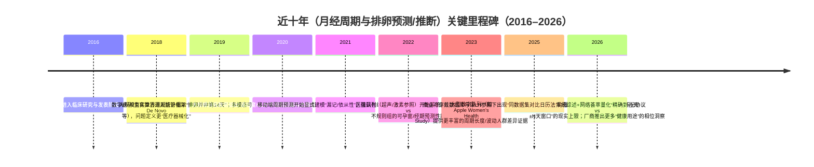

# 月经周期与排卵预测/推断的研究现状与前沿综述

## 执行摘要

月经与生育相关预测大致分成两类任务：其一是**“周期事件预测”**（例如下一次月经开始日、周期长度）；其二是**“排卵/可孕窗推断”**（例如排卵日、可孕窗/受孕概率窗口）。两者在**标签可得性、误差容忍度、临床参照标准**上差异显著：周期事件常依赖自报出血日志而易受漏记影响；排卵与可孕窗若要“严谨”，通常需要尿/血激素或超声等参照标准（更贵、更难规模化）。citeturn10view2turn21view0turn8search11

过去十年主流路线可以概括为三代：  
第一代以“日历/平均法”为代表，易在不规则人群上失效；第二代引入体温（BBT/皮温）与部分生理信号（HR/HRV/呼吸率等），实现对排卵后体温“双相转变”的捕捉，从而更稳健地**事后估计排卵**或识别窗内变化；第三代开始把**多模态信号 + 统计/机器学习 + 个体化**结合，并在部分工作中显式做不规则分层评估。citeturn14view0turn12view0turn13view0turn21view0turn30view0

证据层面上，最新系统综述与网络荟萃分析显示：可穿戴数字技术（WDT）对“精确到排卵当天”的判定整体并不容易（汇总准确度约 0.56），但在“±2–3 天窗口”附近可以取得更高的综合准确度（±2 天约 0.90；±3 天约 0.88）。从信号贡献看，**体温仍是核心**，多参数融合与更先进算法（如随机森林一类）在汇总层面带来小幅但一致的提升。citeturn21view0

就“日历法 vs 可穿戴法”的增益而言，最有说服力的一类证据来自**同一数据集内对比**：例如一项基于商业数据库并以尿 LH 试纸为参照的研究报告，生理信号法（手指皮温为主）排卵估计 MAE≈1.26 天，显著优于日历法 MAE≈3.44 天，而且在不规则组里日历法误差显著放大（文中给出不规则组日历法 MAE≈6.63 天），而生理信号法相对稳定。citeturn14view0

与您的研究设想（“不规则分型分层评估；量化可穿戴相对日历基线的增益；做 0/1/few-shot 个体化；严格 subject-wise 评估”）对照：现有工作**确实开始做不规则分层**（按周期长度、按波动度 CLD、按“是否不规则”分组），但对“**不规则亚型（均值偏移但稳定 vs 高波动）**”的系统化定义与报告仍不普遍；同时，小样本可穿戴研究中仍常见“按周期随机切分/窗口切分”的潜在泄漏风险。因而，若您把“分型—评估—个体化策略—严格划分”做成一个闭环，并把结论组织成“哪个亚型真正受益于可穿戴与历史数据/个性化”，研究问题是**明确且具有方法学贡献**的。citeturn22view0turn10view2turn14view0turn12view0turn28view0

## 问题定义与临床参照标准

本领域常被混用的概念，建议在论文/报告中明确区分（这会直接决定数据、指标与评估协议）：

**周期预测（cycle prediction）**通常指：预测下一次月经开始日/周期长度/经期长度等。其“真值”多来自自报出血记录或应用内日志，关键困难在于：漏记或不坚持记录会把周期长度“人为拉长”，导致模型学到的是“行为+生理”的混合。对此，已有大规模移动端数据建模工作把“依从性/漏记”作为显式变量建模，并展示在用户波动更大时误差上升。citeturn10view2turn22view0

**排卵推断（ovulation inference）/可孕窗检测（fertile window detection）**通常指：估计排卵日或“排卵前后某个窗口”的事件/区间。可孕窗在医学上一般按“排卵日前 5 天到排卵后约 24 小时”来刻画（对应精子与卵子存活时间），而受孕概率在该窗内逐日变化并在排卵前一天附近达到峰值。citeturn21view0  
参照标准方面，系统综述与临床综述均强调：**经阴道超声联合血清激素（如孕酮）**是临床实践中最“金标准”的排卵确认手段之一；在规模化研究与消费级应用中更常用的是尿 LH 峰、尿/血孕酮代谢物等“间接标准”。citeturn21view0turn8search11

这一差异带来一个重要后果：  
很多可穿戴系统（包括部分厂商功能）更擅长识别排卵后由孕酮驱动的**体温升高/生理相位转变**，因此更天然是“事后估计（retrospective）”；而“提前几天预测排卵”需要更强的模型与更可靠的参照标签，且对不规则人群更难。系统综述也提示：越追求“精确到某一天”，总体性能越受限，“±2–3 天”往往是更现实的临床/现实世界折中指标。citeturn21view0turn2search0turn14view0

## 数据集与信号来源

### 数据集类型与规模谱系

本领域数据大致分三类，各自的“能回答的问题”不同：

**大规模移动端自报数据（多为私有）**：代表性的是基于月经应用的数十万用户、数百万周期级数据。它们适合研究“周期长度分布、波动性指标、群体差异、统计建模与预测”，但“排卵真值”往往缺失或较稀疏，且必须严肃处理漏记。citeturn22view0turn10view2turn23view0

**可穿戴连续信号 + 轻量参照（如尿 LH）**：常见于消费级设备生态或招募型随访研究。这类数据可做排卵日/相位检测，但参照仍有噪声（自测、漏测）。一项基于商业数据库、以尿 LH 试纸作为基准的研究给出了 964 人、1155 个排卵周期的规模，并进行了按周期长度/波动/年龄的分层对比（这类“同数据集对比日历基线”的设计非常有价值）。citeturn14view0

**可穿戴信号 + 临床金标准参照（超声/血清激素）**：规模通常较小，但因参照更强，适合做机制验证与严谨评估。一类研究通过在医院队列中采集体温、心率等信号，同时用超声与血清激素确认排卵日，并报告规则与不规则组差异。citeturn12view0turn26search10turn13view0

### 典型信号与采样

系统综述指出，体温（包括 BBT 与不同部位皮温）是可孕窗检测的核心信号；同时，HR、HRV、呼吸率等多信号融合在汇总层面略优于单一体温。citeturn21view0  
生理机制上，孕酮的产热效应会带来排卵后约 0.3–0.7℃ 的体温升高；同时静息心率与 HRV 也呈现相位相关变化。citeturn21view0turn20view0

image_group{"layout":"carousel","aspect_ratio":"1:1","query":["wearable ring skin temperature sensor","fertility tracking wristband wearable","Apple Watch wrist temperature sensor","WHOOP strap womens hormonal insights","Natural Cycles app temperature tracking"],"num_per_query":1}

### 厂商功能与可得信息的现实边界

- Apple Watch 的“回顾性排卵估计”明确依赖夜间腕温数据与算法来检测排卵后的“双相转变”，并强调需要至少两个周期的夜间佩戴才能产生估计，且官方明确提示不应用作避孕或诊断用途。citeturn2search0turn2search20  
- Oura 的公开说明显示其“Cycle Insights”使用温度偏移来跟踪/预测周期，并在帮助文档中将温度偏移作为核心依据。citeturn2search5turn2search1  
- WHOOP 的公开 FAQ 明确表示其功能并非用于“为受孕目的预测排卵”，而是用于健康与训练/恢复相关的相位估计与提示。citeturn6search2turn2search3  
- Fitbit 的“皮温”等健康指标在帮助文档中有说明，但就“在经期/排卵推断里如何使用温度”的官方技术细节公开较少；社区讨论也反映了用户对把体温纳入经期/排卵算法的强需求与现实差距。citeturn2search10turn2search6turn2search26  

（在论文中建议把“可获取的连续信号、缺失模式、设备依从性”作为独立变量报告，因为它们往往决定模型能否稳定工作。系统综述也把缺失与可用性视为影响性能的重要现实因素。citeturn21view0turn14view0）

## 建模方法谱系

### 日历与基于规则的方法

日历法通常用历史周期长度的均值/中位数或假设“排卵发生在下次月经前固定天数（常取黄体期≈12 天）”来估计排卵日或可孕窗。它的核心问题是：**周期差异主要由卵泡期长度驱动**，因此“固定中点/固定天数”在现实世界里不稳健。基于 Natural Cycles 大样本真实世界数据的分析显示：卵泡期均值约 16.9 天且范围很宽，而黄体期相对更稳定；并且“排卵在第 14 天”这一常识对多数人并不成立。citeturn8search6turn14view0  
综合性综述也直接总结：仅用四类日历法的应用，其排卵日预测准确率范围可低至 17%–89%，且往往以“扩大预测窗口”换取更高命中率，牺牲可用性。citeturn30view0

### 统计模型与概率生成式模型

大规模自报数据更常用层级贝叶斯、混合效应、状态空间/半马尔可夫等方法，用于在群体层面吸收信息、在个体层面输出个性化预测，并显式处理缺失/依从性。  
例如，基于 18.6 万用户、约 200 万周期的周期长度数据建模工作，将“漏记/跳过记录概率”纳入生成式框架，并展示模型在周期推进过程中可动态更新预测；该工作也用周期长度差异（CLD）作为“规律性/波动性”指标，指出波动度更高的用户绝对误差更大。citeturn10view2turn22view0

对于“从多变量自报症状序列里标注生殖事件”，隐半马尔可夫模型（HSMM）路线强调：它能更自然地建模“状态持续时间”并处理状态相关缺失，且作者在合成数据与部分标注真实序列上报告了较高标注准确率，并提供实现。citeturn24view0

### 机器学习与深度学习

在可穿戴与多模态场景，常见做法是把连续信号切成窗口、做特征工程（均值/幅度/节律特征等），再用 RF/SVM/梯度提升等传统模型或浅层神经网络进行分类/回归。系统综述的汇总分析提示：RF 在多研究汇总中对应的准确度排名更靠前；这并不意味着“RF 永远最优”，但说明在样本规模不大、噪声较多时，强基线的集成模型非常难被忽视。citeturn21view0turn28view0

在更强调“提前预测排卵/可孕窗”的工作里，会显式做“时间段分割（例如围绕排卵日前后某个 8 天窗口）+多模态融合”，并报告在高度不规则组中 AUROC 仍可维持在 0.84–0.88 的水平（该证据来自会议论文摘要层面的公开信息，细节仍需看全文）。citeturn27view0

## 评估协议与指标

### 评估协议：最常见的“坑”是泄漏

如果把“同一受试者的不同周期/不同天窗”同时放入训练与测试，模型可能学到**个体恒定特征**（例如体温基线、睡眠习惯、设备佩戴模式），从而在测试集上显得很强，但对新用户泛化并不可靠。  
因此，在您要强调“严格 subject-wise evaluation”时，建议在论文中把拆分策略写成可复现模板：

- **跨人泛化（群体模型）**：Leave-one-subject-out（LOSO）或按人划分 train/val/test；适合回答“对新用户 0-shot 有多好”。可穿戴相位分类研究中明确使用了“leave-last-cycle-out”或对比 LOSO 以讨论“是否引入一点个体信息就能明显提升”。citeturn28view0  
- **个体内预测（个体模型/在线更新）**：按时间前后切分（例如前 k 个周期训练、后 1 个周期测试），保持严格的时间因果。大规模周期预测模型也强调了“随着周期推进动态更新预测”的评估。citeturn10view2turn14view0  

### 指标选择：把“点预测误差”与“窗口命中”分开

- **事件日期预测（周期开始日、排卵日）**：MAE（天）最直观；同时建议报告误差分布（中位数、P90）以避免被少量极端值支配。Oura 的生理法与日历法对比就直接用平均误差/MAE，并在不规则组展示日历法误差放大。citeturn14view0  
- **可孕窗（区间/多天分类）**：准确率往往会受类不平衡与窗口宽度影响，因此建议同时给 sensitivity/specificity、AUC、以及“±N 天”分层结果。系统综述明确显示“±2–3 天”窗口性能更高，而“精准到当天”更难。citeturn21view0turn12view0turn13view0  
- **概率输出的可解释性**：如果输出“某天在可孕窗的概率/不确定性区间”，应报告校准（Brier score、reliability curve 等）。周期预测生成式模型也指出校准对于减少不确定性很重要。citeturn10view2  

## 个体化与不规则周期处理

### 不规则的定义与分层：从“一个标签”走向“可操作的亚型”

医学与公共卫生语境里，“不规则”常被定义为周期长度经常小于 21 天或大于 35 天；并且有资料指出约 14%–25% 人群可能经历不规则周期（不同定义下比例会变动）。citeturn8search1turn8search0  
但对建模而言，“不规则”至少包含两个统计维度：  
1) **均值偏移（shifted mean）**：例如长期偏短或偏长但相对稳定；  
2) **高波动（high variability）**：周期长度方差/CLD 很大，且波动可能来自生理或记录漏记的混合。

研究界已经开始用更“建模友好”的波动指标来刻画不规则：例如在大规模自报数据里用“相邻周期长度差（CLD）”来衡量波动，并给出“>9 天”为严格高波动阈值；该工作也强调需要先剔除低参与度周期以减少“行为伪波动”。citeturn22view0  
而在可穿戴+临床参照的数据里，也有研究把不规则进一步按周期长度分成“<25 天”和“>35 天”之类子组，观察性能差异。citeturn12view0

这意味着：您提出的“均值偏移但稳定 vs 高波动”的亚型分层，是对现有“只按长短或只按是否不规则”的一种更细致、也更贴近算法决策的划分方式；关键在于把定义写成可复现规则，并在论文里用同一套规则贯穿数据划分与结果报告。

### 个体化策略：从“用历史平均”到“0/1/few-shot”

现有个体化主要出现三种形态：

- **弱个性化（历史统计 + 群体先验）**：日历法、均值/中位数、或层级贝叶斯模型把个体历史与群体分布结合；在周期推进中动态更新。citeturn10view2turn14view0  
- **结构化个性化（个体状态空间/HSMM）**：把个体时间序列看成状态序列，显式建模持续时间与缺失机制。citeturn24view0  
- **学习型个性化（fine-tuning/transfer learning）**：在小样本可穿戴研究中，已有工作在文献回顾中提到“用多人的数据预训练，再用单个个体的前两个月数据微调，第三个月测试”的个体化示例（这类证据多以引用方式出现，建议您在自己工作中用更严格的 protocol 重做并系统化）。citeturn28view0  

从“研究空白”的角度看：在月经/排卵预测这一具体任务上，**把 0-shot、1-shot、few-shot 作为主问题来系统评估**的文章仍不多见；更常见的是“模型本身带一点个人历史输入”而非明确的 few-shot 适配实验。因此，把 few-shot 个体化写成清晰实验矩阵（见最后一节建议）会更容易形成方法学贡献。

## 代表性工作对比与近十年里程碑

### 代表性工作对比表（覆盖日历法、可穿戴与混合路线）

下表选取约 16 项具有代表性的论文/官方文件，覆盖：任务定义、数据来源与规模、方法、评估协议、结果与不规则分析（若有）。为避免把不同任务强行“同指标对比”，表中保留了各自常用指标。

| 工作（年份） | 任务定义 | 数据集/规模/信号 | 方法 | 评估协议要点 | 主要结果（文中指标） | 局限与是否分析不规则 |
|---|---|---|---|---|---|---|
| entity["organization","American College of Obstetricians and Gynecologists","us obgyn professional society"] 委员会意见（2015） | 临床“正常/异常”月经模式框架 | 临床指南文本 | — | — | 给出青少年与成人周期范围等临床要点 | 非算法；用于定义与纳入排除标准。citeturn8search0 |
| entity["company","Natural Cycles","fertility awareness app"] 大规模真实世界周期特征（2019） | 周期/卵泡期/黄体期统计 | 124,648 用户，612,613 排卵周期；含 BBT、LH 等 | 统计分析 | 真实世界队列 | 卵泡期长度分布宽，黄体期更稳定；“排卵在第14天”并不普遍 | 非预测模型，但奠定“日历法误差来源”。citeturn8search6 |
| MCTA 综述（2021） | 应用预测准确性与研究用途 | 文献综述 | — | — | 日历法类应用排卵日预测准确率 17–89%（取决于方法/窗宽） | 不同 app/研究异质性大；强调不规则人群体验差。citeturn30view0 |
| entity["organization","U.S. Food and Drug Administration","us regulator"] De Novo 审评（2018） | 医疗器械监管语境下的生育算法输入/输出 | 官方审评文件（PDF） | — | — | 描述使用 BBT、经期信息、可选排卵/早孕测试等输入，算法输出生育状态 | 监管文件非学术评估；但提供“医疗器械级”问题定义边界。citeturn15search0 |
| entity["company","Clue by BioWink","period tracking app company"] 大规模波动度刻画（2020） | 周期统计与不规则度指标 | 378,694 用户，4.9M 自然周期；自报症状与周期 | 统计 + “CLD”波动指标；剔除低参与度周期 | 群体层分析 | 提出 median CLD 并用 >9 天作严格高波动阈值；不同波动端人群分布差异明显 | 以“波动度”定义不规则更贴近建模；但不直接做可穿戴增益评估。citeturn22view0 |
| 周期开始日预测（JAMIA, 2022） | 下一次月经开始日/周期长度预测 + 依从性建模 | 186,106 用户；训练前10个周期、预测第11个周期 | 层级生成式模型，显式建模漏记/跳过；对比 mean/median/CNN/RNN/LSTM | 按用户序列化（前10训后1测），并随“当前日”动态更新 | 给出不同日 RMSE；并展示波动度（CLD）越高绝对误差越大；低波动组中位绝对误差可达 ~1.5 天 | 强调“行为伪信号”；对不规则做了连续分层（CLD），但不是“均值偏移 vs 高波动”的双维亚型。citeturn10view2turn9view0 |
| HSMM 标注（IEEE JBHI, 2022） | 从多变量自报序列标注生殖事件/状态 | 自报多变量序列（文献未在 PubMed 摘要中给出具体规模） | 分层 HSMM，显式缺失机制 | 合成数据 + 部分标注真实序列 | 报告合成数据 90%+ 标注准确率；真实序列约 93% | 侧重“标注/缺失建模”，不是直接对外推预测性能。citeturn24view0 |
| entity["organization","Apple Women’s Health Study","digital cohort study, us"]（npjDM, 2023） | 周期长度与波动的群体差异 | 12,608 参与者，165,668 周期（研究起始 2019） | 流行病统计模型 | 队列清洗与回归 | 报告年龄/族裔/BMI 与周期长度、波动的关联与幅度 | 非预测，但为“不规则分层与偏倚控制”提供先验。citeturn23view0 |
| Ava 手环（JMIR, 2019） | 实时识别 6 天可孕窗 | 237 人，夜间佩戴；WST/HR/HRV/RR/灌注；尿 LH 确定窗关闭 | 混合效应建模 + ML（文中训练“识别可孕窗”算法） | 前瞻性随访；以 LH 作为参照 | 可孕窗检测准确率约 90%（95%CI 0.89–0.92） | 受试者偏向备孕人群；是否严格跨人划分需看全文细节；不规则分析不突出。citeturn20view0 |
| 医院队列（Reprod Biol Endocrinol, 2022） | 可孕窗 + 月经期预测；并比较规则/不规则 | 89 规则/25 不规则；BBT（耳温计）+ HR（腕带）；超声+血清激素定排卵 | 线性混合模型 + ML 概率函数估计 | 前瞻性；有临床参照 | 规则组：可孕窗 acc≈87.46%/AUC≈0.899；不规则组显著下降（acc≈72.51%，AUC≈0.581）；并把不规则按周期长短再分组 | 有“不规则”且做子分组，但分型仍偏“长短”，未系统化“高波动 vs 均值偏移”。citeturn12view0turn26search10 |
| 医院队列（Reprod Biomed Online, 2025） | 可孕窗 + 月经预测（含提前3天预测） | 136 规则/47 不规则；WST/HR/HRV/RR；确认排卵周期数（270/84） | ML（以 WST+HR 为主） | 前瞻性；以确认排卵周期评估 | 规则组可孕窗 AUC≈0.869；不规则组 AUC≈0.763；月经开始日标注与提前预测在不规则组显著更难（如 3 天提前预测 acc≈50.8%） | 不规则显式报告；但“可穿戴相对日历增益”与“亚型分层”仍可加强。citeturn13view0 |
| Oura 商业数据库验证（JMIR, 2025） | 排卵日估计（与日历法对照） | 964 人，1155 个排卵周期；指端皮温为主；尿 LH 试纸为参照 | 信号处理 + 排卵估计算法；并与日历法比较 | 同数据集内分层（周期长短、波动、年龄） | 生理法：检测率 96.4%，MAE≈1.26 天；日历法 MAE≈3.44 天；不规则组日历法 MAE≈6.63 天而生理法稳定 | 仅含“有排卵”的周期；参照为自报 LH；对不规则做了分层但未做更细亚型。citeturn14view0 |
| 可穿戴相位识别（npj Women’s Health, 2025） | 3/4 相位分类（含“排卵相位窗口”定义） | 18 人 65 周期；皮温/EDA/IBI/HR | RF 等分类器；窗口特征 | leave-last-cycle-out；并讨论 LOSO 与个体化信息 | 三相分类 acc≈87% AUC≈0.96；日级追踪四相 acc≈68% AUC≈0.77 | 样本小；但对“拆分协议与个体化信息”有较清晰讨论。citeturn28view0 |
| 睡眠 HR 节律特征（Comput Biol Med, 2025） | 相位分类 + 排卵日检测 | 40 人，最多 3 周期；自由生活；用“minHR（昼夜节律谷值）”特征 | XGBoost；比较 day/day+minHR/day+BBT | nested leave-one-group-out；并按睡眠时间波动分层 | 在睡眠时间高波动组，minHR 模型优于 BBT 模型，排卵日绝对误差降低约 2 天（摘要陈述） | 把“行为不规律（睡眠波动）”作为分层维度，是值得借鉴的“非周期维度不规则”。citeturn29view0 |
| 多模态 HRV+温度（IEEE EMBC, 2025） | “提前”排卵窗口预测 | ECG HRV + 睡眠温度传感；聚焦排卵前5天到后2天的 8 天游程 | 特征融合 + LightGBM | 摘要未给出严格拆分细节 | 报告总体 AUROC≈0.73；在“高度不规则组”AUROC≈0.84，“未定义组”≈0.88 | 会议摘要信息有限；但强调“时间分割+多模态”对不规则可能更有效。citeturn27view0 |
| 系统综述与网络荟萃（npjDM, 2026） | WDT 检测可孕窗/排卵的总体证据 | 纳入 27 项研究（检索至 2025-01-01） | 系统综述 + Bayes NMA | 统一汇总不同窗口定义 | 精确到排卵日 pooled acc≈0.56；±2 天≈0.90；±3 天≈0.88；体温为核心，多信号/更强算法略优 | 强调异质性与窗口定义差异；为“该用什么窗口评估”提供依据。citeturn21view0 |
| Apple Watch 官方说明（2025） | 回顾性排卵估计（产品能力边界） | 腕温 + 日志；需夜间佩戴与至少两个周期 | 算法检测双相转变（公开描述） | 产品说明 | 明确“在排卵发生后估计”，并用于改进经期预测；提示不能用于避孕/诊断 | 属官方功能边界说明；可用于论文讨论“临床/产品可用性差异”。citeturn2search0turn2search20 |
| WHOOP FAQ/说明（2026） | 相位估计与提示（非生育用途） | 皮温/恢复等指标与日志（公开描述） | 厂商算法（细节有限） | 产品说明 | 明确“不用于为受孕预测排卵”，预测会随数据积累改进 | 透明度有限但体现厂商对“用途与风险”的界定。citeturn6search2turn2search3 |

### 近十年里程碑时间线（2016–2026）



### 常见指标与典型性能区间（用于“写作时的量级对齐”）

为帮助您在写作/实验中定位结果的合理量级，下表把不同任务的“常见指标/典型区间”总结为**经验范围**（注意：不同研究窗宽、参照标准、样本构成差异很大，不应做断言式横向排名）：

- **排卵日“回顾性估计”**：在有足够体温相关数据且以尿 LH 为参照的研究中，MAE 可到 ~1–2 天量级；日历法在同设定下通常更大，且在不规则人群中可明显恶化到 >6 天量级。citeturn14view0  
- **可孕窗检测**：多模态可穿戴在一些前瞻性队列中报告准确率 ~0.85–0.90；但不规则组的灵敏度/准确率往往显著下降。citeturn20view0turn12view0turn13view0  
- **严格意义的“精确到排卵当天”**：系统综述汇总显示总体准确度不高（~0.56），而放宽到 ±2–3 天窗口可显著提高。citeturn21view0  

## 研究空白、与你研究设想的关系、以及优先实验建议

### 空白判断：现有文献“做了什么”与“没做透什么”

现有证据已经较清楚地支持三点：

第一，“日历法”在不规则人群上更差，而且这种差并非小数点级别，而可能是**倍数级误差扩大**；同时，同一数据集内对照显示可穿戴生理法能在不规则组保持更稳定的误差。citeturn14view0turn30view0  

第二，不规则评估正在被重视，但多数研究仍停留在：  
- “规则 vs 不规则”二分（例如按是否落在某个长度区间），或  
- 单一维度分组（只按周期长度、或只按波动度 CLD）。citeturn12view0turn22view0turn14view0  
对您关心的“**均值偏移但稳定** vs **高波动**”这样更贴近算法行为的亚型，目前至少从主流论文呈现方式看仍不普遍（即使部分论文做了子分组，也往往未把分型作为主线叙事组织结果）。citeturn12view0turn22view0

第三，小样本可穿戴研究里，拆分策略与可复现评估仍是潜在薄弱点：有研究已经开始把 leave-last-cycle-out、LOSO 等写清楚并讨论“引入一点个体信息 vs 跨人泛化”的差异，但领域整体尚未形成统一模板。citeturn28view0turn10view2

据此评估，您的研究聚焦（不规则分型分层、量化可穿戴增益、0/1/few-shot 个体化、严格 subject-wise）是**有意义且有潜在新意**的；真正决定贡献大小的是：您能否把“分型—协议—结果—结论”做成可复现范式，并产出可迁移的结论（例如：哪一类不规则最需要历史数据，哪一类主要受益于实时生理信号，哪一类需要 few-shot 才能追上）。citeturn21view0turn22view0turn14view0

### 优先实验清单（按“最可能形成论文主贡献”的顺序）

**实验一：严格的“可穿戴 vs 日历基线”增益分解（核心）**  
目标：回答“可穿戴信号到底比日历法好在哪、对谁更好、在什么指标上更好”。  
建议做法：在同一批用户上实现至少三条基线：  
- 日历基线 A：rolling mean/median 周期长度预测下次月经开始日（或排卵日前固定黄体期天数法）citeturn10view2turn14view0  
- 日历基线 B：更保守的“扩大窗口”策略（用于对齐综述里‘窗越宽命中越高’的现象）citeturn30view0  
- 可穿戴模型：至少 1) 单温度；2) 温度+HR/HRV（对应系统综述“多参数略优”的结论）citeturn21view0turn12view0  
输出：按您定义的不规则亚型分层报告 delta（提升幅度），并把“窗口宽度”作为显式自变量（例如 ±1、±2、±3 天）。citeturn21view0turn14view0

**实验二：不规则亚型分型与“错误来源诊断”（方法学贡献点）**  
目标：不只给性能数字，而是解释“为什么会错”。  
建议分型（示例，可据数据调整阈值）：  
- 计算每个用户的平均周期长度 μ、波动度（SD 或 median CLD）、以及“长短偏移量 |μ−28|”。CLD 指标与阈值可参考大规模研究（如 >9 天为高波动）。citeturn22view0turn10view2  
- 定义亚型：  
  - S1：均值偏移大但波动低（“稳定偏长/偏短”）  
  - S2：均值接近典型但波动高（“高波动”）  
  - S3：均值偏移大且波动高（“偏移+高波动”）  
- 额外维度：把“可用信号缺失率/佩戴依从性”纳入分层（Oura 的验证研究就把“缺失过多”作为排除条件并解释其必要性）。citeturn14view0turn21view0  

然后在每个亚型里做误差分解：  
- 日历法误差：主要来自卵泡期长度的可变性（可用 Natural Cycles 大样本统计作为机制支撑）citeturn8search6turn14view0  
- 可穿戴法误差：主要来自信号噪声（温度受环境/睡眠影响等）、以及标签噪声（尿 LH 参照与超声参照差异）。citeturn21view0turn14view0turn2search4  

**实验三：0/1/few-shot 个体化矩阵（把“历史数据是否必要”变成实证结论）**  
目标：回答“历史数据对不规则人群的改善有多大、需要多少个周期才有效”。  
建议矩阵：  
- 0-shot：只用群体模型；评估新用户首周期。  
- 1-shot：用用户第 1 个周期做适配（例如更新个体偏置/校准温度基线/微调最后一层）。  
- few-shot：k=2,3,5…（以可用数据为准）。  
评估协议必须严格按人划分，并按时间前后切分，避免同一周期不同窗口泄漏。citeturn28view0turn10view2  
在叙事上，建议把结果组织成“每个亚型达到某个 MAE/AUC 门槛所需的 shot 数”，这会比单纯报一个总体均值更有可解释性。

**实验四：把“非周期维度的不规则”纳入（提高现实世界价值）**  
例如睡眠时间高度不规律、夜班、发热等。已有工作显示，在睡眠时间波动大的情况下，用基于心率节律特征的模型可能比 BBT 更鲁棒，并能减少排卵日误差。citeturn29view0  
如果您的数据包含睡眠/活动，可把这类因素作为“第二轴分层”，进一步回答“谁在现实世界里会掉性能”。

### 数据集与落地建议：在“可公开复现”与“参照标准”之间取平衡

从公开文献看，高质量（尤其带超声/激素参照）的数据往往规模小且不公开；大规模数据往往私有或主要是自报日志。citeturn21view0turn10view2turn23view0  
因此，若您强调“开源/可复现”，可以考虑两条路线并行：

- **路线 A（可复现优先）**：用可获取的开源或可共享数据做“周期开始日预测 + 不规则分型 + few-shot protocol”方法学贡献，把“排卵参照不足”作为限制写清楚，同时用系统综述的结论对齐“窗口评估”的合理范围。citeturn21view0turn10view2  
- **路线 B（参照标准优先）**：在小规模临床参照数据上做“可穿戴增益/不规则亚型”的关键验证（哪怕 N 不大），并用严格 subject-wise 防止泄漏，避免“漂亮但不可泛化”的结果。citeturn12view0turn29view0  

### 常见陷阱清单（建议在论文中显式写成“威胁与控制”）

1) **记录漏记导致的伪不规则**：必须像大规模研究那样考虑参与度/漏记机制，否则“高波动”可能只是“忘记记录”。citeturn22view0turn10view2  
2) **参照标准不一致**：尿 LH、PdG、超声、血清孕酮并非等价，尤其在“精确到某一天”任务上差异会直接影响 MAE。citeturn21view0turn8search11turn14view0  
3) **窗口宽度带来的“虚高准确率”**：准确率必须与窗口长度同时报告，否则无法比较；系统综述已经清晰显示窗口越宽越容易“看起来准确”。citeturn21view0turn30view0  
4) **跨人泛化与个体内预测被混在一起**：请始终明确你回答的是 0-shot 还是个体化后的性能，并用不同拆分协议支撑。citeturn28view0turn10view2  
5) **只报平均值掩盖不规则人群失败**：建议至少报告 P50/P90 或按分型分层均值，避免“总体还行，但不规则全崩”。citeturn12view0turn13view0turn14view0  

---

```text
关键参考链接（可复制粘贴）

系统综述/方法学
- Shi et al., 2026, npj Digital Medicine: 10.1038/s41746-025-02320-8 (PMC: https://pmc.ncbi.nlm.nih.gov/articles/PMC12886881/)
- Li et al., 2022, JAMIA: 10.1093/jamia/ocab182
- Li et al., 2020, npj Digital Medicine: 10.1038/s41746-020-0269-8
- Symul & Holmes, 2022, IEEE JBHI: 10.1109/JBHI.2021.3110716

可穿戴/混合（含不规则对比）
- Goodale et al., 2019, JMIR: 10.2196/13404
- Yu et al., 2022, Reproductive Biology and Endocrinology: 10.1186/s12958-022-00993-4
- Luo et al., 2025, Reproductive BioMedicine Online: 10.1016/j.rbmo.2025.104795
- Thigpen et al., 2025, JMIR (Oura ovulation validation, PMC): https://pmc.ncbi.nlm.nih.gov/articles/PMC11829181/
- Kilungeja et al., 2025, npj Women’s Health: https://www.nature.com/articles/s44294-025-00078-8
- Masuda et al., 2025, Computer Methods and Programs in Biomedicine: 10.1016/j.compbiomed.2025.109705
- Kim et al., 2025, IEEE EMBC: 10.1109/EMBC58623.2025.11253520

日历法/监管与官方边界（用于“现实世界意义”讨论）
- FDA De Novo (Natural Cycles): https://www.accessdata.fda.gov/cdrh_docs/reviews/DEN170052.pdf
- Apple Support（回顾性排卵估计说明，2025-11-18 更新）: https://support.apple.com/en-sg/120357
- WHOOP FAQ（不用于受孕排卵预测）: https://www.whoop.com/us/en/thelocker/womens-hormonal-insights/
```